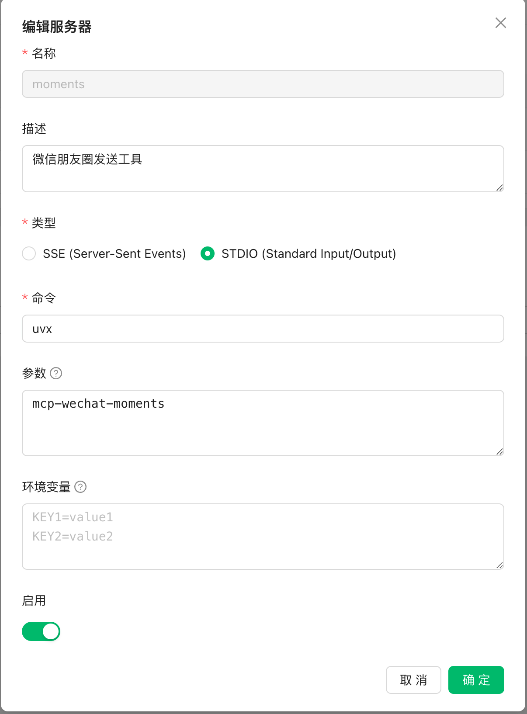

# MCP Wechat Moment Server

use applescript to publish moments on macOS

# Installation

Recommend use `uvx` to setup

## requirements
We need cliclick to emulate mouse click event
> brew install cliclick

Use uvx to install this packages
> uvx mcp-wechat-moments

# Configuration & Usage
Use client like Cherry Studio

## Auto Publish

Auto-Publish Feature is not enabled by default, you could enable it via env variables:

> AUTO_PUBLISH=true

